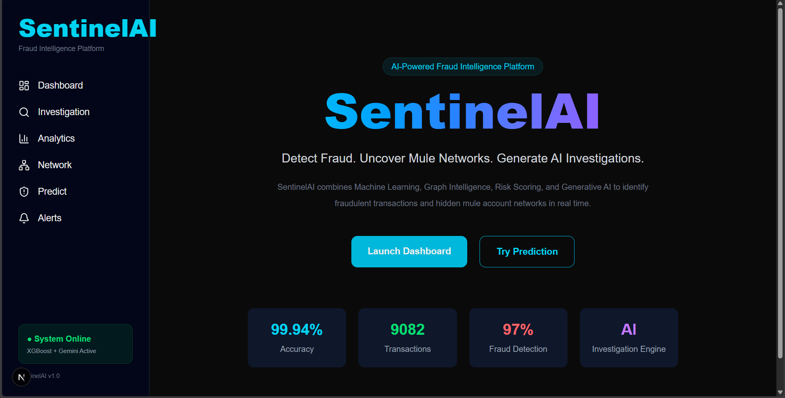
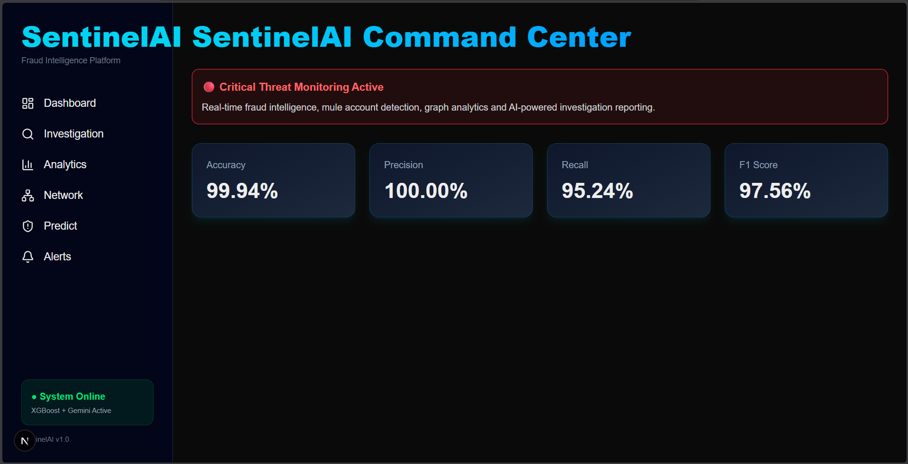
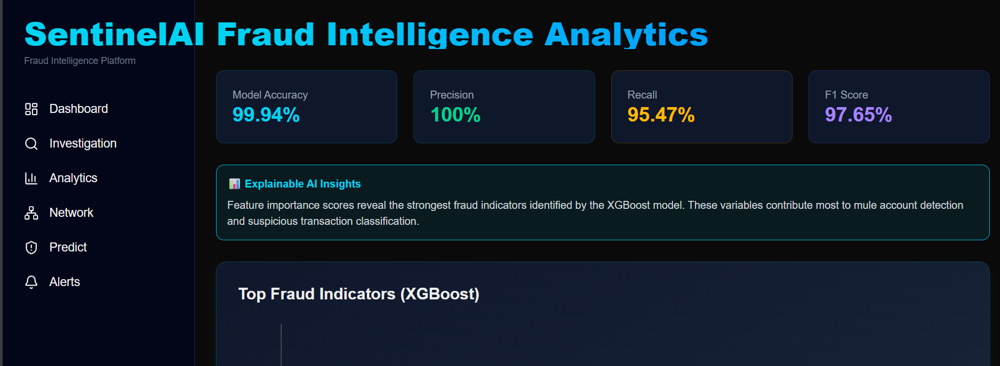
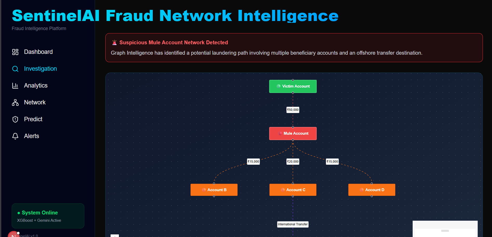
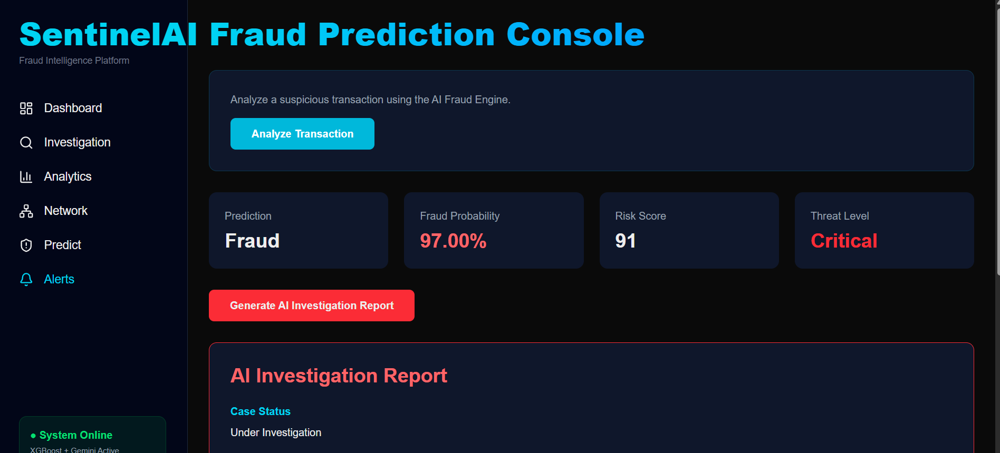
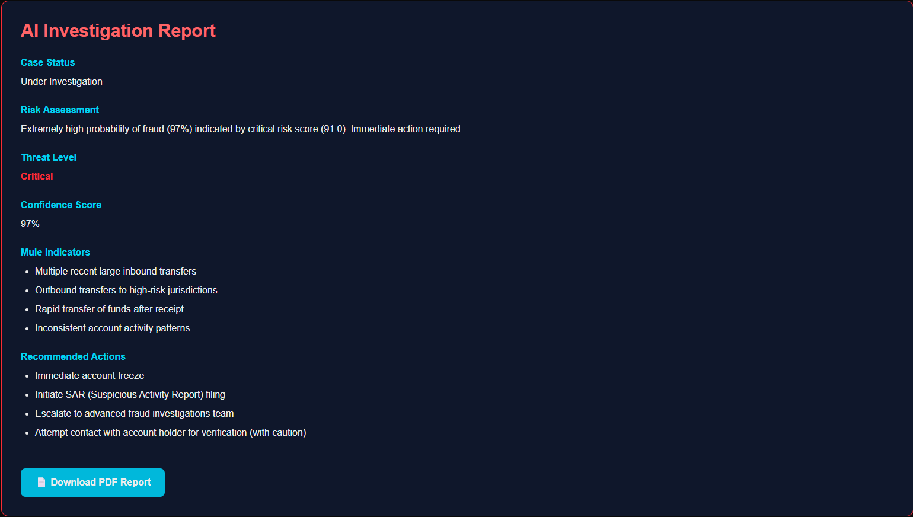
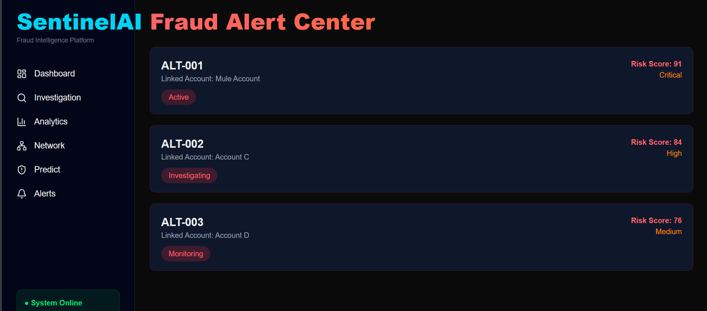

# 🛡️ SentinelAI

### AI-Powered Fraud Intelligence Platform

Detect Fraud. Uncover Mule Networks. Generate AI Investigations.

SentinelAI is a full-stack fraud detection platform that combines Machine Learning, Graph Intelligence, Risk Scoring, and Generative AI to identify fraudulent transactions and hidden mule account networks in real time.

---

## 🚀 Live Demo

Frontend:
https://sentinal-nr9lgi3i6-struggler16042004s-projects.vercel.app/

Backend API:
https://sentinalai-ottj.onrender.com/docs

Repository:
https://github.com/Pushkar1604/SentinalAI

---

## 📌 Problem Statement

Financial institutions process thousands of transactions every minute.

Traditional rule-based fraud detection systems:

- Analyze accounts in isolation
- Miss hidden relationships between accounts
- Struggle to identify organized mule account networks
- Generate excessive false positives
- Lack explainability for investigators

SentinelAI addresses these challenges using AI-powered fraud detection, graph intelligence, and automated investigation reporting.

---

# ✨ Features

### 🔍 Fraud Detection Engine

- XGBoost-based fraud prediction
- Real-time fraud probability scoring
- Dynamic risk scoring (0-100)
- Threat classification system

### 🕸️ Mule Network Intelligence

- Graph-based account relationship analysis
- Mule account detection
- Suspicious transaction path visualization
- Offshore transfer monitoring

### 📊 Fraud Analytics Dashboard

- Model performance metrics
- Feature importance visualization
- Explainable AI insights
- Fraud indicator analysis

### 🤖 AI Investigation Center

- Gemini-powered investigation reports
- Automated case summaries
- Threat assessment generation
- Recommended mitigation actions

### 🚨 Alert Management

- Real-time fraud alerts
- Risk-based prioritization
- Investigation tracking
- Alert monitoring system

---

# 🏗️ System Architecture

```text
Transaction Data
        │
        ▼
 ML Fraud Detection Engine
 (XGBoost Model)
        │
        ▼
 Fraud Probability
 Risk Score
 Threat Level
        │
        ▼
 Graph Intelligence Engine
        │
        ▼
 Mule Account Detection
 Network Analysis
        │
        ▼
 Gemini AI Investigation Engine
        │
        ▼
 Automated Investigation Report
```

---

# 🛠️ Tech Stack

## Frontend

- Next.js 15
- TypeScript
- Tailwind CSS
- React Flow
- Recharts
- Axios
- Lucide React

## Backend

- FastAPI
- Python
- XGBoost
- Scikit-Learn
- Pandas
- NumPy

## AI

- Google Gemini 2.5 Flash

## Deployment

- Vercel
- Render

---

# 📈 Model Performance

| Metric | Score |
|----------|----------|
| Accuracy | 99.94% |
| Precision | 100.00% |
| Recall | 95.47% |
| F1 Score | 97.65% |

---

# 📷 Screenshots

## Landing Page



---

## Command Center Dashboard



---

## Fraud Intelligence Analytics



---

## AI Investigation Center


---

## Mule Network Intelligence



---

## Fraud Prediction Engine



---

## AI Investigation Report



---

## Alert Monitoring Center



---

# 🔥 Key Highlights

✅ XGBoost Fraud Detection Model

✅ Graph Intelligence Network Analysis

✅ Mule Account Detection

✅ Dynamic Risk Scoring

✅ AI-Powered Investigation Reports

✅ Real-Time Fraud Alerts

✅ Modern Cybersecurity Dashboard

✅ Full Stack Deployment

---

# 📂 Project Structure

```text
SentinalAI
│
├── frontend
│   ├── app
│   ├── components
│   ├── lib
│   └── public
│
├── backend
│   ├── app
│   │   ├── api
│   │   ├── schemas
│   │   ├── services
│   │   └── models
│   │
│   └── requirements.txt
│
└── README.md
```

---

# ⚙️ Installation

## Clone Repository

```bash
git clone https://github.com/Pushkar1604/SentinalAI.git
cd SentinalAI
```

---

## Frontend Setup

```bash
cd frontend

npm install

npm run dev
```

---

## Backend Setup

```bash
cd backend

pip install -r requirements.txt

uvicorn app.main:app --reload
```

---

## Environment Variables

Create:

```env
GEMINI_API_KEY=your_api_key_here
```

---

# 🎯 Future Enhancements

- Real Banking Dataset Integration
- Real-Time Streaming Transactions
- Neo4j Graph Database
- JWT Authentication
- Multi-Tenant Dashboard
- Explainable AI SHAP Analysis
- Fraud Heatmaps
- Investigator Workflow Management
- PDF Report Export
- SIEM Integration

---

# 👨‍💻 Author

### Pushkar Singh

Computer Science Engineer

Cybersecurity Enthusiast | Machine Learning | Full Stack Development

GitHub:
https://github.com/Pushkar1604

---

# ⭐ Support

If you found this project useful:

⭐ Star the repository

🍴 Fork the repository

🛡️ Build something awesome with SentinelAI